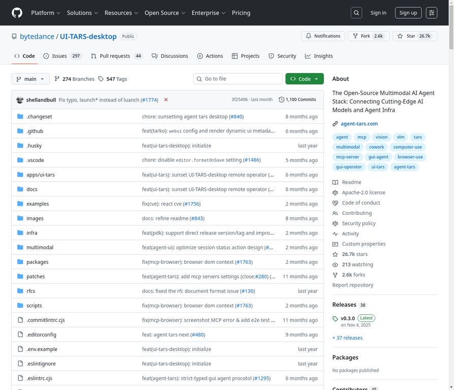

# 1. bytedance/UI-TARS-desktop

**URL:** [https://github.com/bytedance/UI-TARS-desktop](https://github.com/bytedance/UI-TARS-desktop)
**Stars:** 26701
**Language:** TypeScript
**Description:** 

---
## Detailed Description

Project 1: bytedance/UI-TARS-desktop
=====================================
URL: https://github.com/bytedance/UI-TARS-desktop
Stars: 26,701 (2,613 today)
Language: TypeScript
License: Apache-2.0

Description:
The Open-Source Multimodal AI Agent Stack: Connecting Cutting-Edge AI Models and Agent Infra

Core Features:
- 🤖 Natural language control powered by Vision-Language Model
- 🖥️ Screenshot and visual recognition support
- 🎯 Precise mouse and keyboard control
- 💻 Cross-platform support (Windows/MacOS/Browser)
- 🔄 Real-time feedback and status display
- 🔐 Private and secure - fully local processing

Technical Stack:
- TypeScript (89.0%)
- MDX (8.3%)
- JavaScript (1.1%)
- Built on MCP (Model Context Protocol)
- Supports multiple LLM providers (Anthropic Claude, Volcengine Doubao)

Use Cases:
- Desktop automation through natural language
- Browser automation and web scraping
- GUI testing and interaction
- Remote computer/browser control
- Integration with MCP tools for real-world tasks

Key Highlights:
- 26.7k stars, 2.6k forks
- 45 contributors
- 38 releases (latest v0.3.0)
- Active development with 1,100+ commits
- Comprehensive documentation and quick start guides

Screenshot: ./images/01_bytedance_ui-tars-desktop.webp

---

## Tech Stack

## Use Cases

## Screenshot

