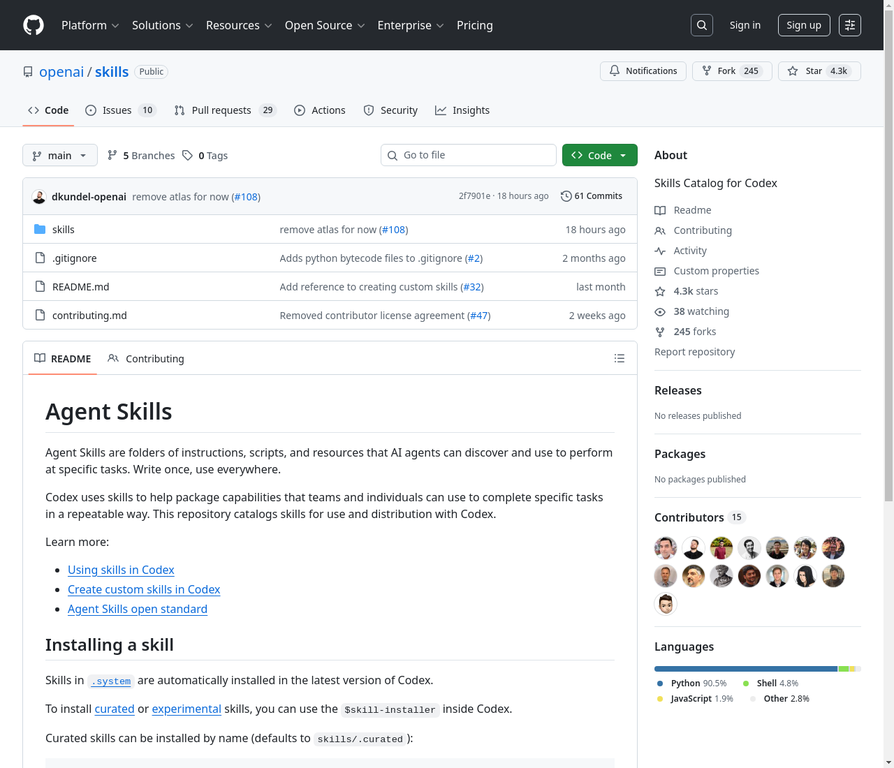

# 2. openai/skills

**URL:** [https://github.com/openai/skills](https://github.com/openai/skills)
**Stars:** 4300
**Language:** Python
**Description:** Codex 的技能目录

---
## Detailed Description

Agent Skills 是指令、脚本和资源的文件夹，AI 代理可以发现并使用它们来执行特定任务。一次编写，随处使用。

Codex 使用技能来帮助打包团队和个人可以用来以可重复的方式完成特定任务的功能。此仓库收录了用于 Codex 的技能目录。

## Tech Stack

Python, Shell, JavaScript, Codex, $skill-installer

## Use Cases

1. AI 代理发现并使用技能来执行特定任务。
2. 为团队和个人打包功能，以可重复的方式完成任务。
3. 收录用于 Codex 的技能目录。
4. 使用 $skill-installer 安装精选或实验性技能。

## Screenshot

