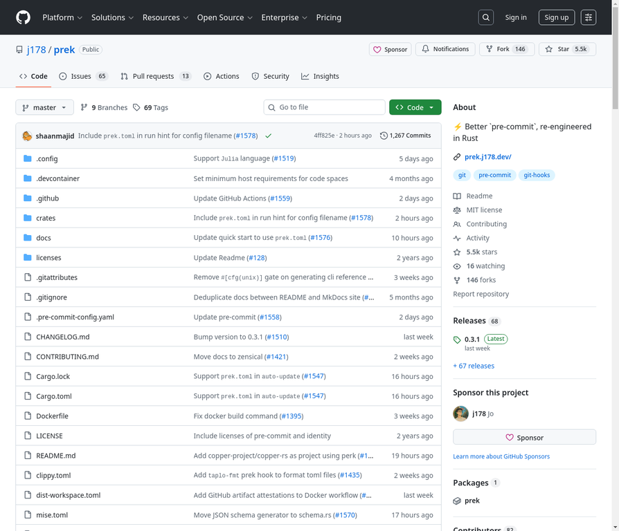

# 4. j178/prek

**URL:** [https://github.com/j178/prek](https://github.com/j178/prek)
**Stars:** 5500
**Language:** Rust
**Description:** ⚡ Better `pre-commit`, re-engineered in Rust

---
## Detailed Description

pre-commit是一个用于运行多种语言编写的钩子的框架，它管理运行钩子所需的语言工具链和依赖项。
prek是pre-commit的重新构想版本，用Rust构建。它旨在成为一个更快、无依赖且可替代的工具，同时还提供了一些额外长期需求的功能。

注意：
尽管prek还很新，但它已经被一些项目和组织使用或推荐，例如CPython、Apache Airflow、FastAPI等。如果您正在寻找pre-commit的替代品，请尝试一下——我们很乐意听取您的反馈！

核心特性：
🚀 单一二进制文件，无依赖，无需Python或任何其他运行时。
⚡ 比pre-commit更快，磁盘空间使用效率更高。
🔄 与原始pre-commit配置和钩子完全兼容。
🏗️ 内置对monorepos（即工作区模式）的支持。
🐍 与uv集成，用于管理Python虚拟环境和依赖项。
🛠️ 改进了Python、Node.js、Bun、Go、Rust和Ruby的工具链安装，并在钩子之间共享。
📦 内置了一些常见钩子的Rust原生实现。

## Tech Stack

Rust, uv, Python, Node.js, Bun, Go, Ruby

## Use Cases

1. 提高代码质量和一致性
2. 自动化代码检查和格式化
3. 简化多语言项目开发工作流
4. 加速CI/CD流程中的预提交检查
5. 管理和共享开发环境依赖

## Screenshot

