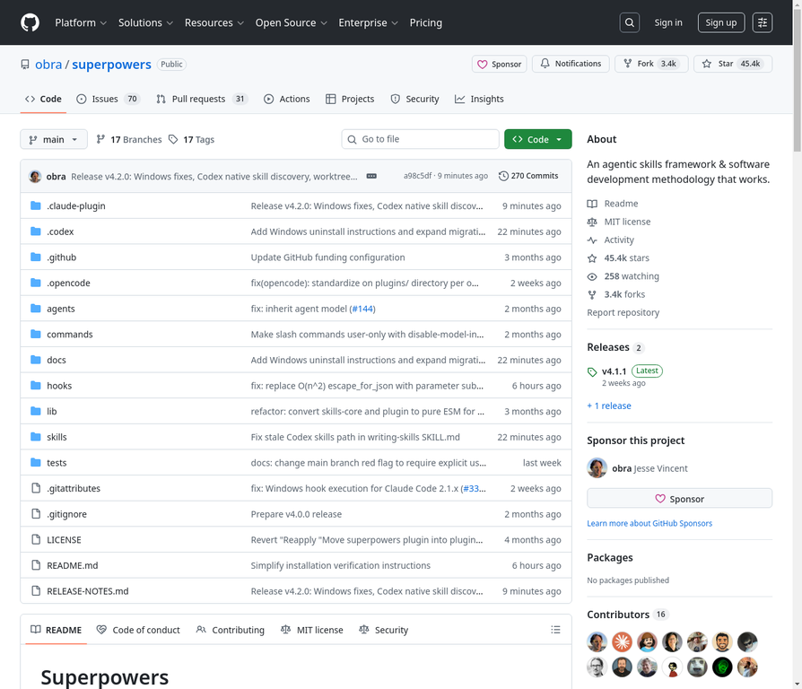

# 6. obra/superpowers

**URL:** [https://github.com/obra/superpowers](https://github.com/obra/superpowers)
**Stars:** 45400
**Language:** Shell
**Description:** An agentic skills framework & software development methodology that works.

---
## Detailed Description

### 工作原理\nIt starts from the moment you fire up your coding agent. As soon as it sees that you're building something, it doesn't just jump into trying to write code. Instead, it steps back and asks you what you're really trying to do.\n\nOnce it's teased a spec out of the conversation, it shows it to you in chunks short enough to actually read and digest.\n\nAfter you've signed off on the design, your agent puts together an implementation plan that's clear enough for an enthusiastic junior engineer with poor taste, no judgement, no project context, and an aversion to testing to follow. It emphasizes true red/green TDD, YAGNI (You Aren't Gonna Need It), and DRY.\n\nNext up, once you say \"go\", it launches a subagent-driven-development process, having agents work through each engineering task, inspecting and reviewing their work, and continuing forward. It's not uncommon for Claude to be able to work autonomously for a couple hours at a time without deviating from the plan you put together.\n\nThere's a bunch more to it, but that's the core of the system. And because the skills trigger automatically, you don't need to do anything special. Your coding agent just has Superpowers.\n\n### 设计理念\nTest-Driven Development - Write tests first, always\nSystematic over ad-hoc - Process over guessing\nComplexity reduction - Simplicity as primary goal\nEvidence over claims - Verify before declaring success

## Tech Stack

安装方式：\nNote: Installation differs by platform. Claude Code has a built-in plugin system. Codex and OpenCode require manual setup.\n\nClaude Code (via Plugin Marketplace)\n\nIn Claude Code, register the marketplace first:\n\n/plugin marketplace add obra/superpowers-marketplace\n\nThen install the plugin from this marketplace:\n\n/plugin install superpowers@superpowers-marketplace\nVerify Installation\n\nStart a new session and ask Claude to help with something that would trigger a skill (e.g., \"help me plan this feature\" or \"let's debug this issue\"). Claude should automatically invoke the relevant superpowers skill.\n\nCodex\n\nTell Codex:\n\nFetch and follow instructions from https://raw.githubusercontent.com/obra/superpowers/refs/heads/main/.codex/INSTALL.md\n\n\nDetailed docs: docs/README.codex.md\n\nOpenCode\n\nTell OpenCode:\n\nFetch and follow instructions from https://raw.githubusercontent.com/obra/superpowers/refs/heads/main/.opencode/INSTALL.md\n\n\nDetailed docs: docs/README.opencode.md\n主要编程语言：Shell

## Use Cases

- 作为编码代理的软件开发工作流\n- 规范化代理的开发流程\n- 通过技能库扩展代理能力

## Screenshot

