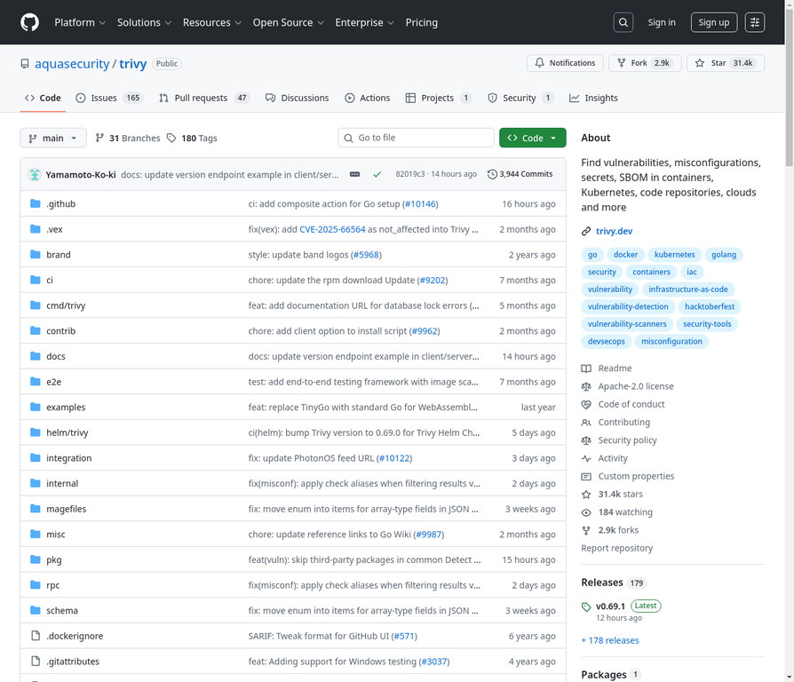

# 7. aquasecurity/trivy

**URL:** [https://github.com/aquasecurity/trivy](https://github.com/aquasecurity/trivy)
**Stars:** 31400
**Language:** Go
**Description:** 在容器、Kubernetes、代码仓库、云等中查找漏洞、错误配置、秘密、SBOM。

---
## Detailed Description

Trivy是一个全面且多功能的安全性扫描器。它拥有多种扫描器，用于发现安全问题，并支持多种目标进行扫描。

扫描目标包括：容器镜像、文件系统、远程Git仓库、虚拟机镜像和Kubernetes。

扫描器可以发现：操作系统软件包和使用的软件依赖（SBOM）、已知漏洞（CVEs）、IaC问题和错误配置、敏感信息和秘密、软件许可证。

Trivy支持大多数流行的编程语言、操作系统和平台。

## Tech Stack

主要编程语言为Go。支持容器镜像、文件系统、Git仓库、虚拟机镜像、Kubernetes等多种扫描目标。可用于检测OS软件包、软件依赖、已知漏洞、IaC问题、敏感信息、秘密和软件许可证。

## Use Cases

1. 扫描容器镜像以发现漏洞和错误配置。
2. 分析文件系统以识别安全问题。
3. 检查Git仓库中的敏感信息和配置错误。
4. 对Kubernetes环境进行安全审计。
5. 生成软件物料清单（SBOM）并检测已知漏洞（CVEs)。

## Screenshot

