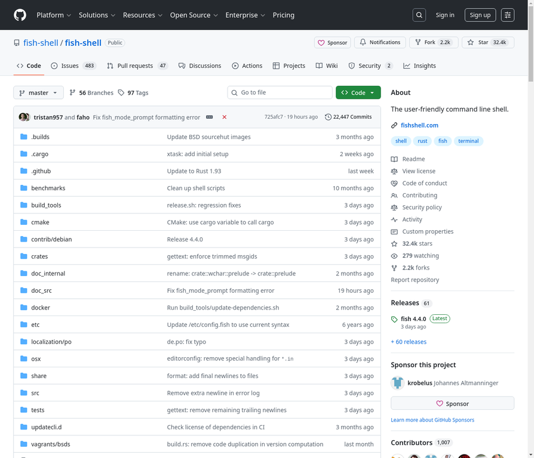

# 8. fish-shell/fish-shell

**URL:** [https://github.com/fish-shell/fish-shell](https://github.com/fish-shell/fish-shell)
**Stars:** 32400
**Language:** Rust
**Description:** fish 是一个智能且用户友好的命令行 shell，适用于 macOS、Linux 等操作系统。

---
## Detailed Description

fish 是一个智能且用户友好的命令行 shell，适用于 macOS、Linux 等操作系统。它包含语法高亮、即时自动建议和高级 Tab 补全等功能，无需配置即可使用。

**核心特性:**
*   **语法高亮**: 实时显示命令语法，提高可读性。
*   **即时自动建议**: 根据历史命令和当前目录提供智能建议。
*   **高级 Tab 补全**: 自动补全命令、文件路径和参数。
*   **无需配置**: 开箱即用，无需复杂设置。

**安装方式:**
*   macOS: Homebrew, MacPorts, 官方安装器。
*   Linux: Debian, Fedora, openSUSE, RHEL/CentOS, Ubuntu PPA。
*   Windows: WSL, Cygwin 或 MSYS2。

**依赖项:**
*   运行 fish 需要：常见的 *nix 系统工具 (mktemp, cat, cut, dirname, ls, mkdir, mkfifo, rm, sh, sort, tee, tr, uname, sed, coreutils, find, awk)。
*   可选功能依赖：man (用于 --help), Python 3.5+ (自动补全生成, fish_config), file 程序 (alt-o 绑定), xsel/xclip/wl-copy/wl-paste/pbcopy/pbpaste (系统剪贴板集成), all-the-package-names NPM 模块 (yarn/npm 补全), colorls (ls 颜色支持)。

**构建依赖:**
*   Rust (1.85+), cargo
*   CMake (3.15+)
*   C 编译器
*   PCRE2 (可选)
*   gettext (可选)
*   互联网连接
*   Sphinx (可选，用于文档构建)
*   diff, git, Python 3.5+, pexpect, less, tmux, wget (用于完整测试套件)

## Tech Stack

Rust, Shell, Python, HTML, JavaScript, CMake, C 编译器, PCRE2, gettext, Sphinx, Homebrew, MacPorts, apt, WSL, Cygwin, MSYS2, mktemp, cat, cut, dirname, ls, mkdir, mkfifo, rm, sh, sort, tee, tr, uname, sed, coreutils, find, awk, man, file, xsel, xclip, wl-copy, wl-paste, pbcopy, pbpaste, all-the-package-names NPM module, colorls, diff, git, pexpect, less, tmux, wget

## Use Cases

日常命令行操作, 脚本编写, 系统管理, 开发环境配置, 跨平台使用 (macOS, Linux, Windows)

## Screenshot

