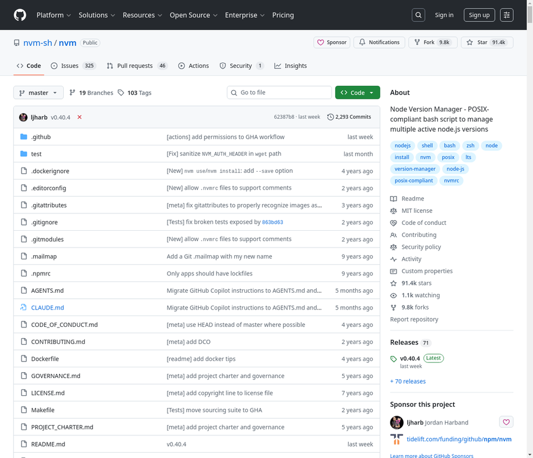

# 9. nvm-sh/nvm

**URL:** [https://github.com/nvm-sh/nvm](https://github.com/nvm-sh/nvm)
**Stars:** 91400
**Language:** Shell
**Description:** Node Version Manager - POSIX-compliant bash script to manage multiple active node.js versions

---
## Detailed Description

nvm是一个Node.js版本管理器，设计为每个用户安装，并按每个shell调用。它可以在任何符合POSIX标准的shell（sh, dash, ksh, zsh, bash）上工作，特别是在Unix、macOS和Windows WSL等平台上。nvm允许通过命令行快速安装和使用不同版本的Node.js，例如使用`nvm use 16`切换版本，或使用`nvm install 12`安装新版本。安装和更新可以通过curl或wget脚本完成，并支持自定义安装源、目录、配置文件和版本。它还支持在Docker容器中安装和使用，并提供了Linux和macOS上的故障排除指南。

## Tech Stack

Node.js, Bash script, POSIX-compliant shells (sh, dash, ksh, zsh, bash), curl, wget, git, Docker

## Use Cases

管理多个Node.js版本; 在不同的项目中使用特定版本的Node.js; 在开发环境中快速切换Node.js版本; 在CI/CD流程中安装和使用Node.js; 在Docker容器中管理Node.js版本

## Screenshot

