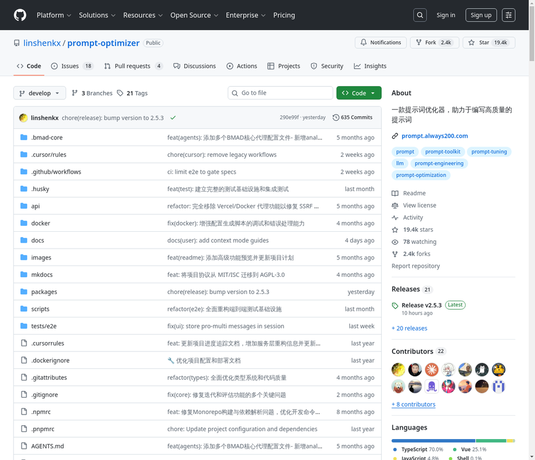

# 10. linshenkx/prompt-optimizer

**URL:** [https://github.com/linshenkx/prompt-optimizer](https://github.com/linshenkx/prompt-optimizer)
**Stars:** 19400
**Language:** TypeScript
**Description:** Prompt Optimizer是一个强大的AI提示词优化工具，帮助你编写更好的AI提示词，提升AI输出质量。

---
## Detailed Description

Prompt Optimizer是一个强大的AI提示词优化工具，帮助你编写更好的AI提示词，提升AI输出质量。支持Web应用、桌面应用、Chrome插件和Docker部署四种使用方式。

核心特性:
* 智能优化：一键优化提示词，支持多轮迭代改进，提升AI回复准确度
* 双模式优化：支持系统提示词优化和用户提示词优化，满足不同使用场景
* 对比测试：支持原始提示词和优化后提示词的实时对比，直观展示优化效果
* 多模型集成：支持OpenAI、Gemini、DeepSeek、智谱AI、SiliconFlow等主流AI模型
* 图像生成：支持文生图（T2I）和图生图（I2I），集成Gemini、Seedream等图像模型
* 高级测试模式：上下文变量管理、多轮会话测试、工具调用（Function Calling）支持
* 安全架构：纯客户端处理，数据直接与AI服务商交互，不经过中间服务器
* 多端支持：同时提供Web应用、桌面应用、Chrome插件和Docker部署四种使用方式
* 访问控制：支持密码保护功能，保障部署安全
* MCP协议支持：支持Model Context Protocol (MCP) 协议，可与Claude Desktop等MCP兼容应用集成

## Tech Stack

TypeScript, Vue, JavaScript, Docker, Vercel, OpenAI API, Gemini API, DeepSeek API, Zhipu AI API, SiliconFlow API, Electron (桌面应用), Chrome Extension

## Use Cases

1. 角色扮演对话：激发小模型潜力
2. 知识图谱提取：保障生产环境的稳定性
3. 诗歌写作：辅助创意探索与需求定制

## Screenshot

