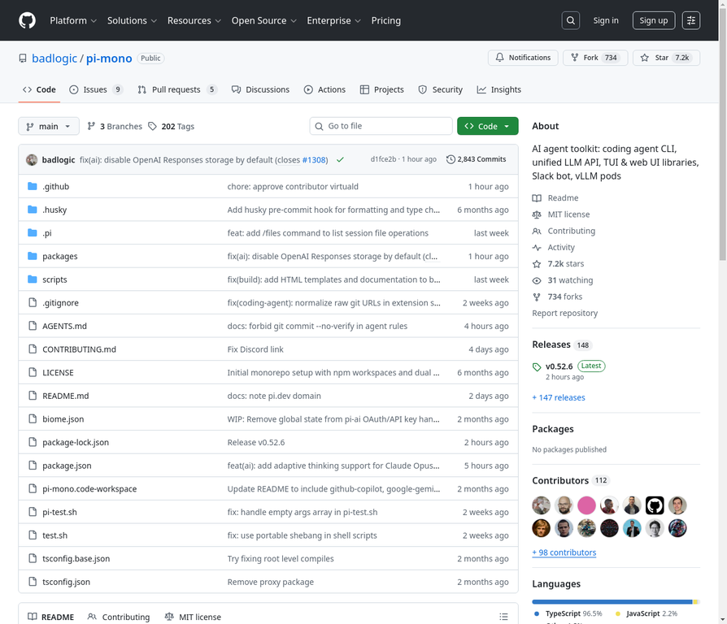

# 14. badlogic/pi-mono

**URL:** [https://github.com/badlogic/pi-mono](https://github.com/badlogic/pi-mono)
**Stars:** 7200
**Language:** TypeScript
**Description:** AI agent toolkit: coding agent CLI, unified LLM API, TUI & web UI libraries, Slack bot, vLLM pods

---
## Detailed Description

Pi Monorepo是一个用于构建AI代理和管理LLM部署的工具包。它包含以下核心功能：
- @mariozechner/pi-ai: 统一的多提供商LLM API (OpenAI, Anthropic, Google等)
- @mariozechner/pi-agent-core: 带有工具调用和状态管理的代理运行时
- @mariozechner/pi-coding-agent: 交互式编码代理CLI
- @mariozechner/pi-mom: 将消息委托给pi编码代理的Slack机器人
- @mariozechner/pi-tui: 带有差分渲染的终端UI库
- @mariozechner/pi-web-ui: 用于AI聊天界面的Web组件
- @mariozechner/pi-pods: 用于管理GPU pod上vLLM部署的CLI

## Tech Stack

TypeScript, JavaScript, npm, tsc

## Use Cases

构建AI代理, 管理LLM部署, 交互式编码, Slack机器人集成, AI聊天界面开发

## Screenshot

