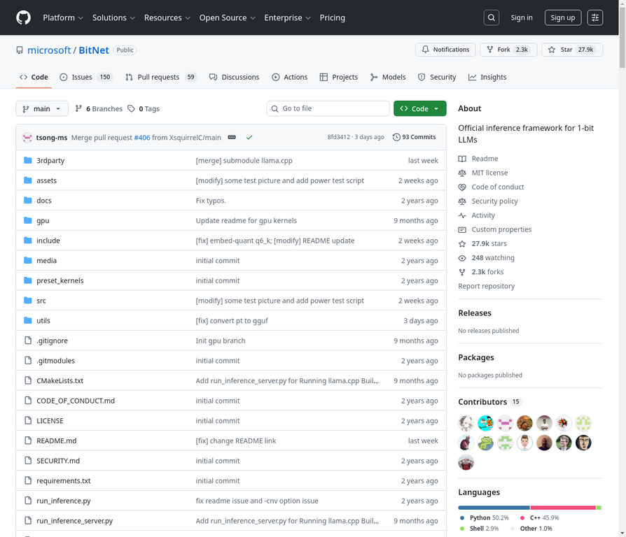

# 15. microsoft/BitNet

**URL:** [https://github.com/microsoft/BitNet](https://github.com/microsoft/BitNet)
**Stars:** 27900
**Language:** Python
**Description:** 适用于1位大型语言模型（LLMs）的官方推理框架。

---
## Detailed Description

bitnet.cpp是针对1位LLM（例如BitNet b1.58）的官方推理框架。它提供了一套优化的内核，支持在CPU和GPU上对1.58位模型进行快速无损推理（NPU支持即将推出）。bitnet.cpp的首次发布旨在支持CPU上的推理。bitnet.cpp在ARM CPU上实现了1.37倍至5.07倍的加速，大型模型性能提升更显著。此外，它将能耗降低了55.4%至70.0%，进一步提高了整体效率。在x86 CPU上，加速范围为2.37倍至6.17倍，能耗降低了71.9%至82.2%。此外，bitnet.cpp可以在单个CPU上运行100B的BitNet b1.58模型，达到与人类阅读相当的速度（每秒5-7个token），显著增强了在本地设备上运行LLM的潜力。最新的优化引入了并行内核实现，支持可配置的平铺和嵌入量化，在不同硬件平台和工作负载上比原始实现额外加速1.15倍至2.1倍。该项目利用Hugging Face上现有的1位LLM来展示bitnet.cpp的推理能力，旨在激发在模型规模和训练token方面大规模1位LLM的开发。

## Tech Stack

Python, C++, Shell, CMake, Clang, Visual Studio, conda, Hugging Face, llama.cpp, T-MAC

## Use Cases

1. 在CPU和GPU上进行1位LLM的快速无损推理。
2. 在本地设备上运行大型1位LLM，实现与人类阅读相当的速度。
3. 优化LLM推理的能耗和效率。
4. 为1位LLM的开发和研究提供基础框架。
5. 在ARM和x86架构上部署高效的1位LLM推理。

## Screenshot

