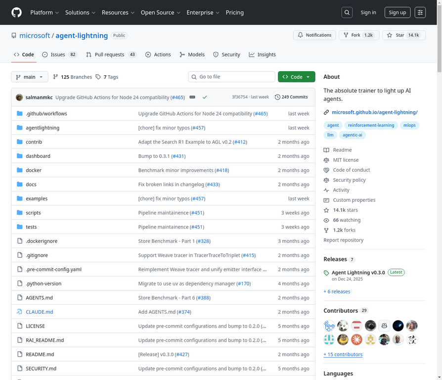

# 16. microsoft/agent-lightning

**URL:** [https://github.com/microsoft/agent-lightning](https://github.com/microsoft/agent-lightning)
**Stars:** 14100
**Language:** Python
**Description:** 点亮AI智能体的绝对训练器。

---
## Detailed Description

Agent Lightning旨在成为点亮AI智能体的绝对训练器。其核心特性包括：
*   通过**几乎零代码更改**将智能体转变为可优化的强大实体。
*   支持**任何**智能体框架（如LangChain, OpenAI Agent SDK, AutoGen, CrewAI, Microsoft Agent Framework等），甚至可以不使用智能体框架（如Python OpenAI）。
*   能够**选择性地**优化多智能体系统中的一个或多个智能体。
*   融合了强化学习、自动提示优化、监督微调等**算法**。

Agent Lightning的架构设计精简，旨在让开发者专注于创意而非底层实现。它允许智能体照常运行，支持任何智能体框架。通过轻量级的`agl.emit_xxx()`辅助函数，或者让追踪器收集每个提示、工具调用和奖励，这些事件被结构化为跨度，流入LightningStore。LightningStore作为中央枢纽，保持任务、资源和追踪的同步。算法从这些跨度中学习，并发布更新的资源，如优化的提示模板或新的策略权重。Trainer将所有部分连接起来，将数据集流式传输给运行器，在存储和算法之间传输资源，并在改进落地时更新推理引擎。整个过程无需重写代码，没有锁定，为从首次部署到持续改进提供了清晰的路径。

## Tech Stack

Python, LangChain, OpenAI Agent SDK, AutoGen, CrewAI, Microsoft Agent Framework, Reinforcement Learning, Automatic Prompt Optimization, Supervised Fine-tuning, pip

## Use Cases

AI智能体训练与优化, 多智能体系统开发, 强化学习研究, 提示工程优化, 代码与数学问题解决

## Screenshot

