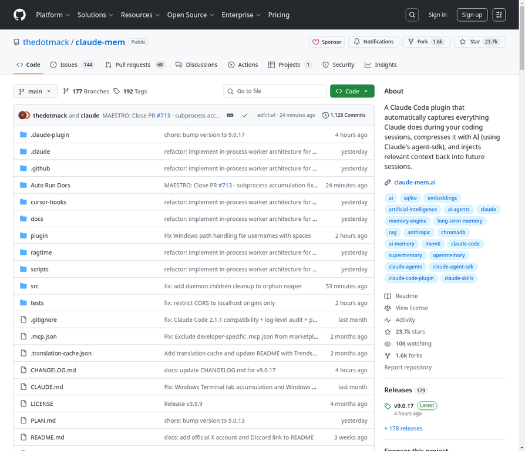

# GitHub Trending Daily Report - 2026-02-06

This report summarizes the top 16 trending projects on GitHub.

## 📋 综合摘要

查看 [GitHub Trending 每日摘要 - 2026-02-06](github_trending_digest_2026-02-06.md) 获取今日热门项目的详细分析和趋势洞察。

## Trending Projects

### 1. [bytedance/UI-TARS-desktop](01_bytedance_UI-TARS-desktop.md)
**Stars:** 26701
**Language:** TypeScript
**Description:** 

### 2. [openai/skills](02_openai_skills.md)
**Stars:** 4300
**Language:** Python
**Description:** Codex 的技能目录

### 3. [thedotmack/claude-mem](03_thedotmack_claude-mem.md)
**Stars:** 23700
**Language:** TypeScript
**Description:** 一个Claude Code插件，自动捕获Claude在编码会话中的所有操作，通过AI压缩并注入相关上下文到未来的会话中。

### 4. [j178/prek](04_j178_prek.md)
**Stars:** 5500
**Language:** Rust
**Description:** ⚡ Better `pre-commit`, re-engineered in Rust

### 5. [topoteretes/cognee](05_topoteretes_cognee.md)
**Stars:** 11800
**Language:** Python
**Description:** AI Agent的记忆，6行代码实现

### 6. [obra/superpowers](06_obra_superpowers.md)
**Stars:** 45400
**Language:** Shell
**Description:** An agentic skills framework & software development methodology that works.

### 7. [aquasecurity/trivy](07_aquasecurity_trivy.md)
**Stars:** 31400
**Language:** Go
**Description:** 在容器、Kubernetes、代码仓库、云等中查找漏洞、错误配置、秘密、SBOM。

### 8. [fish-shell/fish-shell](08_fish-shell_fish-shell.md)
**Stars:** 32400
**Language:** Rust
**Description:** fish 是一个智能且用户友好的命令行 shell，适用于 macOS、Linux 等操作系统。

### 9. [nvm-sh/nvm](09_nvm-sh_nvm.md)
**Stars:** 91400
**Language:** Shell
**Description:** Node Version Manager - POSIX-compliant bash script to manage multiple active node.js versions

### 10. [linshenkx/prompt-optimizer](10_linshenkx_prompt-optimizer.md)
**Stars:** 19400
**Language:** TypeScript
**Description:** Prompt Optimizer是一个强大的AI提示词优化工具，帮助你编写更好的AI提示词，提升AI输出质量。

### 11. [ZeroTworu/anet](11_ZeroTworu_anet.md)
**Stars:** 363
**Language:** Rust
**Description:** 一个简单的Rust VPN客户端/服务器。

### 12. [openclaw/openclaw](12_openclaw_openclaw.md)
**Stars:** 168000
**Language:** TypeScript
**Description:** 您的个人AI助手。支持任何操作系统。任何平台。龙虾之道。🦞

### 13. [asgeirtj/system_prompts_leaks](13_asgeirtj_system_prompts_leaks.md)
**Stars:** 30300
**Language:** JavaScript
**Description:** 收集了来自ChatGPT、Claude和Gemini等流行聊天机器人的系统提示。

### 14. [badlogic/pi-mono](14_badlogic_pi-mono.md)
**Stars:** 7200
**Language:** TypeScript
**Description:** AI agent toolkit: coding agent CLI, unified LLM API, TUI & web UI libraries, Slack bot, vLLM pods

### 15. [microsoft/BitNet](15_microsoft_BitNet.md)
**Stars:** 27900
**Language:** Python
**Description:** 适用于1位大型语言模型（LLMs）的官方推理框架。

### 16. [microsoft/agent-lightning](16_microsoft_agent-lightning.md)
**Stars:** 14100
**Language:** Python
**Description:** 点亮AI智能体的绝对训练器。

## Top 5 Hot Projects by Stars

1. [openclaw/openclaw](01_openclaw_openclaw.md) - 168000 stars
2. [nvm-sh/nvm](02_nvm-sh_nvm.md) - 91400 stars
3. [obra/superpowers](03_obra_superpowers.md) - 45400 stars
4. [fish-shell/fish-shell](04_fish-shell_fish-shell.md) - 32400 stars
5. [aquasecurity/trivy](05_aquasecurity_trivy.md) - 31400 stars

## Trend Analysis

### Programming Language Distribution

| Language | Count |
|---|---|
| TypeScript | 5 |
| Python | 4 |
| Rust | 3 |
| Shell | 2 |
| Go | 1 |
| JavaScript | 1 |

### Popular Domains & Key Technology Trends

- **AI & Machine Learning:** Projects related to AI agents, LLMs, and multimodal models are highly popular (e.g., `bytedance/UI-TARS-desktop`, `openai/skills`, `microsoft/BitNet`).
- **Developer Tools:** Tools that improve developer workflow and productivity continue to be a major trend (e.g., `j178/prek`, `fish-shell/fish-shell`, `nvm-sh/nvm`).
- **Privacy & Security:** Privacy-focused tools and security scanners are gaining traction (e.g., `ZeroTworu/anet`, `aquasecurity/trivy`).

## Archive

- [2026-02-05 Report](https://github.com/DannyFish-11/github-trending-daily/blob/main/2026-02-05/README.md)
