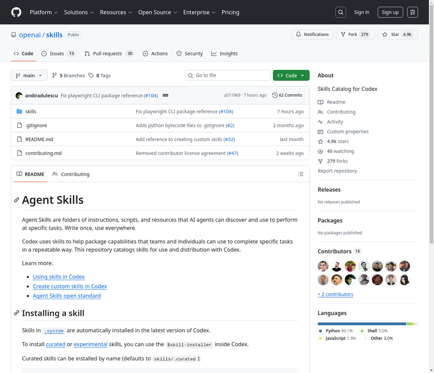
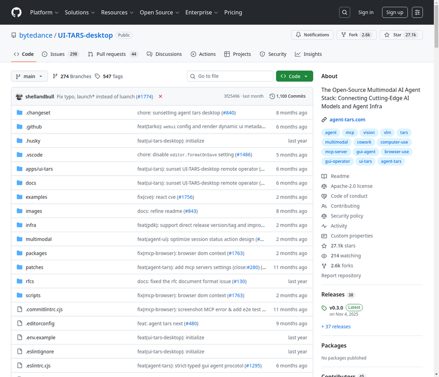
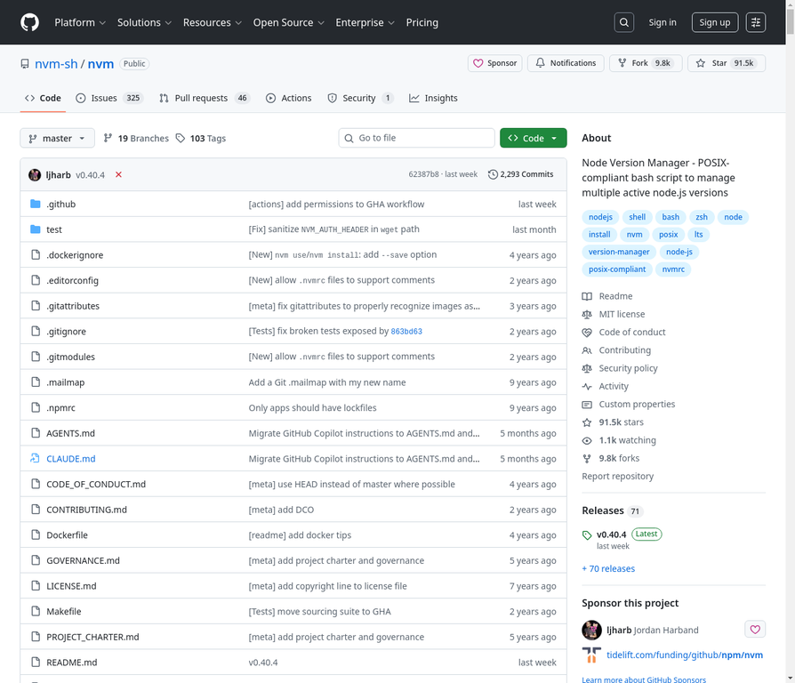
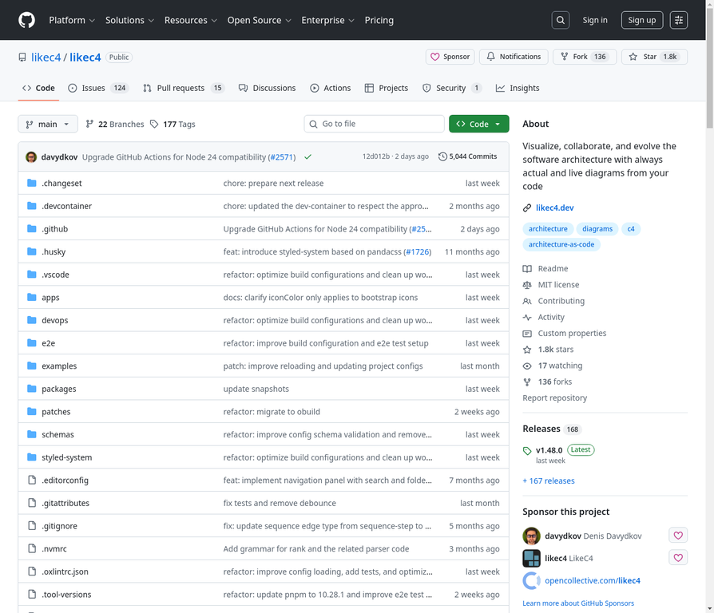
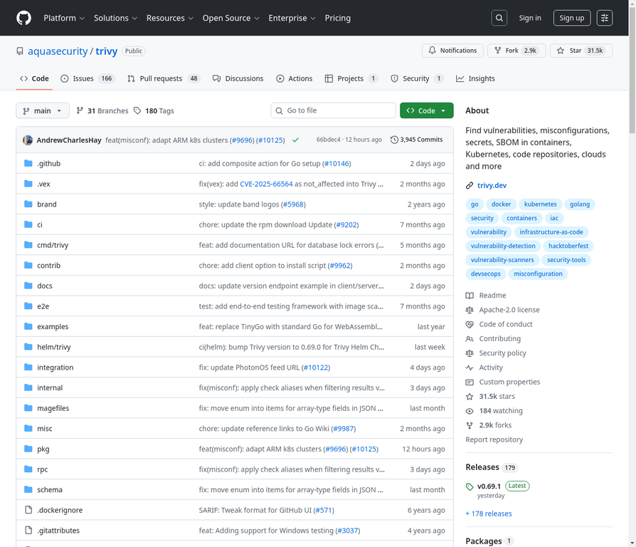
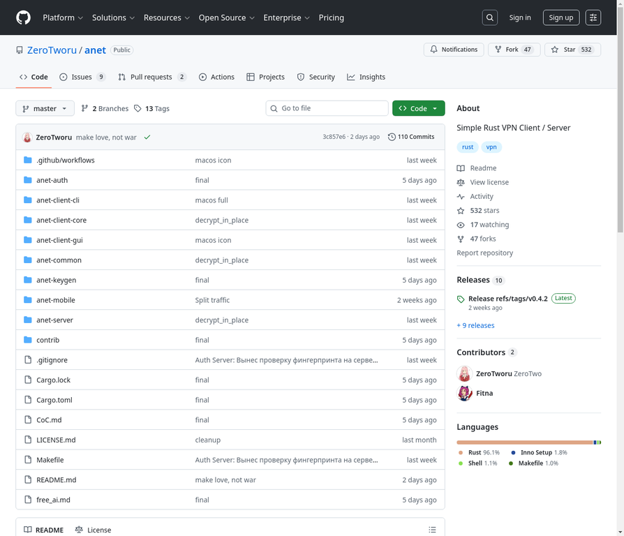
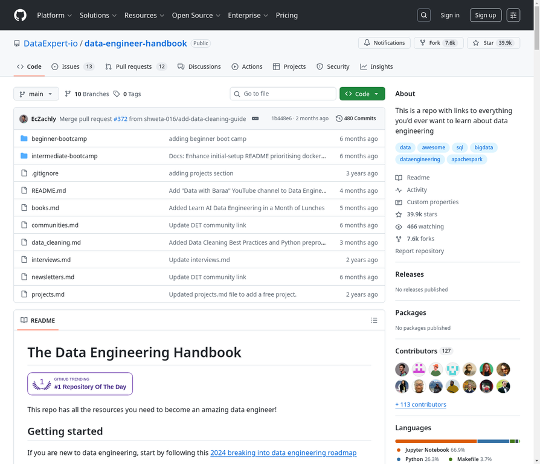
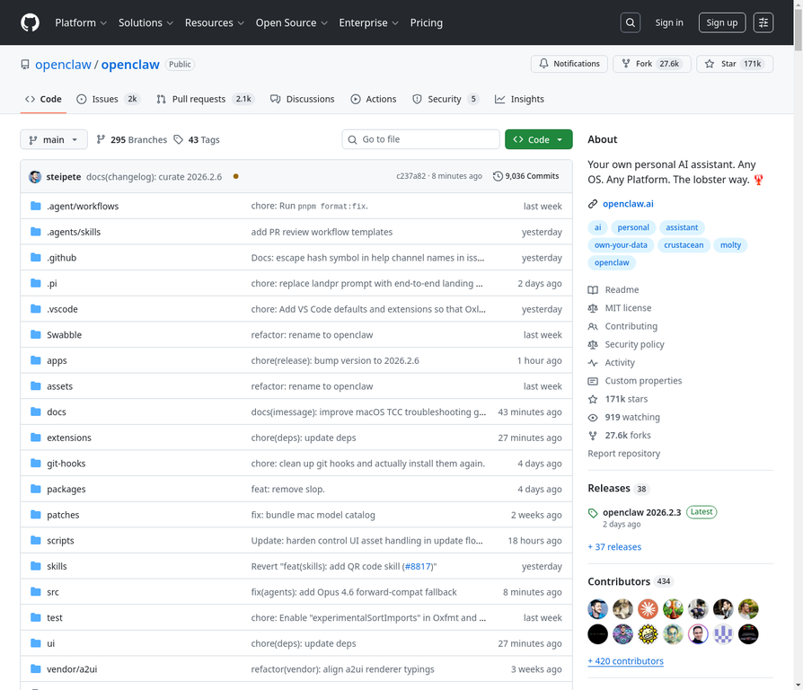
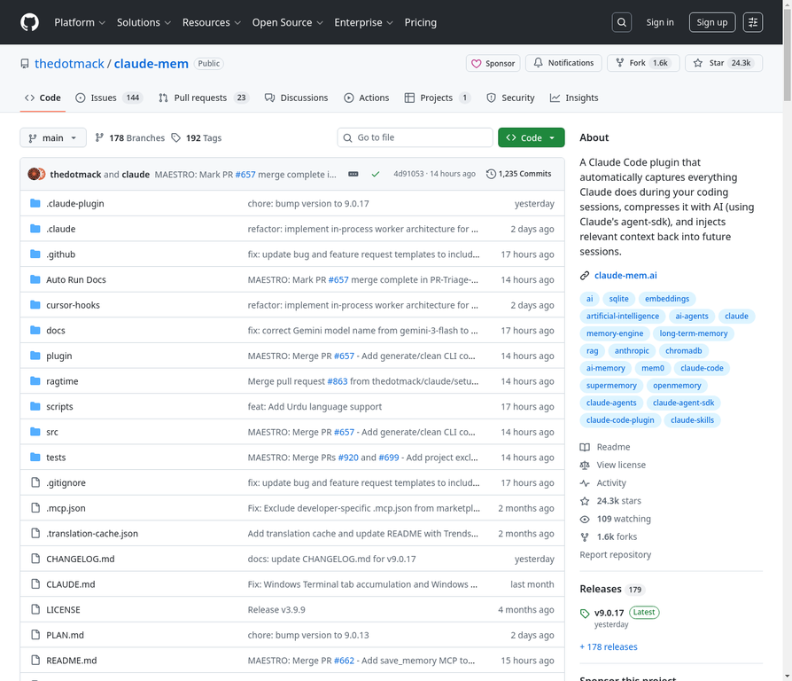
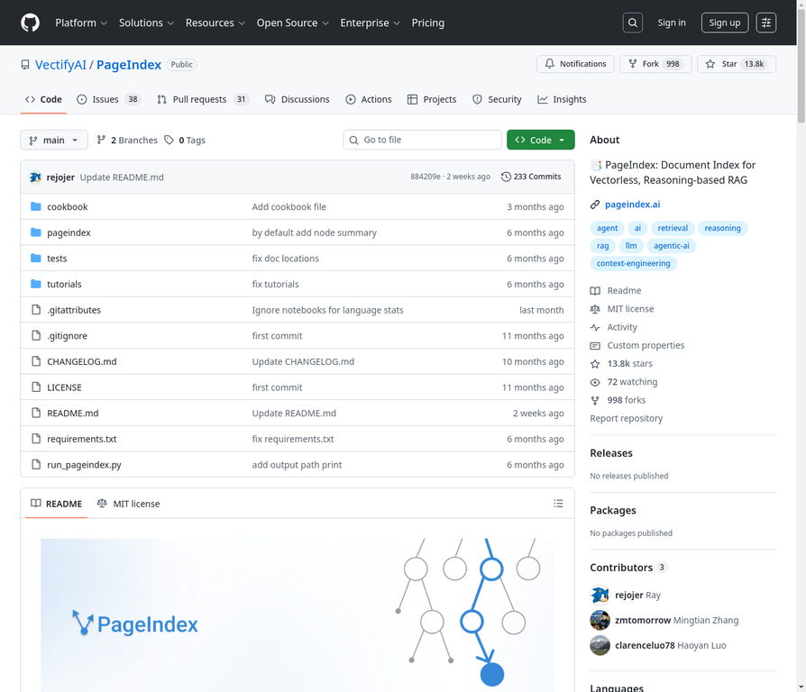

# GitHub热门项目日报 - 2026-02-07

本期日报共收录 **16** 个热门项目，涵盖了AI代理、开发工具、安全、数据工程等多个热门领域。

## 趋势分析

### 热门领域

本期热门项目主要集中在以下几个领域：

- **AI代理与大语言模型 (AI Agent & LLM):** 多个项目围绕AI代理、LLM推理框架、RAG等技术展开，如 `openai/skills`, `bytedance/UI-TARS-desktop`, `microsoft/BitNet`, `VectifyAI/PageIndex` 等，反映出AI应用开发的持续火热。
- **开发工具与效率 (DevTools & Productivity):** `nvm-sh/nvm` 和 `likec4/likec4` 等项目专注于提升开发效率和改善开发流程。
- **安全与隐私 (Security & Privacy):** `aquasecurity/trivy` 和 `Flowseal/zapret-discord-youtube` 等项目关注软件安全和网络隐私问题。

### 编程语言分布

| 编程语言 | 项目数量 |
|---|---|
| TypeScript | 5 |
| Python | 5 |
| Go | 1 |
| Bash | 1 |
| Rust | 1 |
| Batchfile | 1 |
| Jupyter Notebook | 1 |
| Lua | 1 |

## 本期Top 5热门项目

1. **openclaw/openclaw** (171k stars) - 个人AI助手，支持多渠道消息管理和语音交互。
2. **nvm-sh/nvm** (91.5k stars) - 强大的Node.js版本管理工具。
3. **karpathy/nanochat** (42.4k stars) - 低成本训练和部署GPT-2级别LLM的实验平台。
4. **DataExpert-io/data-engineer-handbook** (39.9k stars) - 全面的数据工程资源库。
5. **aquasecurity/trivy** (31.5k stars) - 全面的多功能安全扫描工具。

## 本期项目列表

### 1. bytedance/UI-TARS-desktop



**Star数:** 27 | **编程语言:** TypeScript

**仓库地址:** [https://github.com/bytedance/UI-TARS-desktop](https://github.com/bytedance/UI-TARS-desktop)

**项目描述:**

TARS是一个开源的多模态AI代理技术栈，由字节跳动开发。该项目包含两个核心产品：**Agent TARS**（通用多模态AI代理栈）和**UI-TARS Desktop**（原生GUI代理桌面应用）。Agent TARS将GUI代理和视觉能力带入终端、计算机、浏览器和产品中，通过前沿的多模态大语言模型和与各种现实世界MCP工具的无缝集成，提供更接近人类任务完成方式的工作流程。

**核心特性:**

1. **一键开箱即用CLI**: 支持有界面的Web UI和无界面的服务器执行模式
2. **混合浏览器代理**: 可使用GUI代理、DOM或混合策略控制浏览器
3. **事件流驱动**: 基于协议的事件流驱动上下文工程和代理UI
4. **MCP集成**: 内核基于MCP构建，支持挂载MCP服务器连接现实世界工具
5. **自然语言控制**: 由视觉-语言模型驱动的自然语言控制
6. **跨平台支持**: 支持Windows/MacOS/浏览器多平台
7. **本地/远程操作**: 支持本地和远程计算机及浏览器操作
8. **隐私安全**: 完全本地处理，保护用户隐私

**适用场景:**

1. **自动化任务执行**: 通过自然语言指令完成复杂的计算机操作任务
2. **浏览器自动化**: 自动化网页操作，如预订机票、酒店等
3. **桌面应用控制**: 通过自然语言控制桌面应用程序（如VS Code配置）
4. **远程操作**: 远程控制计算机和浏览器，无需配置
5. **开发者工具**: 为开发者提供GUI自动化工具包
6. **企业级应用**: 构建企业级AI代理解决方案

**安装使用**

Agent TARS CLI快速启动：

```bash
# 使用npx启动
npx @agent-tars/cli@latest

# 全局安装（需要Node.js >= 22）
npm install @agent-tars/cli@latest -g

# 使用指定模型提供商运行
agent-tars --provider volcengine --model doubao-1-5-thinking-vision-pro-250428 --apiKey your-api-key
agent-tars --provider anthropic --model claude-3-7-sonnet-latest --apiKey your-api-key
```

**项目亮点**

- 字节跳动官方开源项目
- 45位贡献者活跃参与
- 完善的文档和教程体系
- 支持多种前沿AI模型
- 活跃的社区支持（Discord、GitHub Discussions）
- 已发布38个版本，持续迭代更新
- 提供丰富的使用案例和演示视频
- 支持流式输出和实时反馈
- 独家支持AIO agent Sandbox隔离执行环境

**相关论文**

Qin, Yujia, et al. "UI-TARS: Pioneering Automated GUI Interaction with Native Agents." arXiv preprint arXiv:2501.12326 (2025).

---

---

### 2. nvm-sh/nvm



**Star数:** 91.5k | **编程语言:** Bash

**仓库地址:** [https://github.com/nvm-sh/nvm](https://github.com/nvm-sh/nvm)

**项目描述:**

nvm (Node Version Manager) 是一个用于管理Node.js版本的工具，它是一个符合POSIX标准的bash脚本，旨在为每个用户安装并为每个shell调用。nvm可以在任何POSIX兼容的shell（如sh, dash, ksh, zsh, bash）上运行，特别是在Unix、macOS和Windows WSL等平台上表现良好。它允许开发者轻松地在不同Node.js版本之间切换，满足不同项目的需求，并简化了Node.js环境的配置和管理。

**核心特性:**

- 快速安装和使用不同版本的Node.js
- 支持POSIX兼容的shell (sh, dash, ksh, zsh, bash)
- 支持Unix, macOS, Windows WSL平台
- 可自定义安装源、目录、配置文件和版本
- 支持在Docker中安装和在CICD任务中使用

**适用场景:**

- 在开发环境中管理和切换多个Node.js版本
- 在持续集成/持续部署 (CI/CD) 流程中确保Node.js版本的一致性
- 在Docker容器中快速部署和使用特定Node.js版本
- 跨Unix、macOS和Windows WSL平台进行Node.js开发和测试

---

### 3. likec4/likec4



**Star数:** 1.8k | **编程语言:** TypeScript

**仓库地址:** [https://github.com/likec4/likec4](https://github.com/likec4/likec4)

**项目描述:**

LikeC4是一个用于描述软件架构的建模语言和工具，能够从代码中生成始终保持最新状态的实时图表，从而实现软件架构的可视化、协作和演进。它受到C4模型和Structurizr DSL的启发，但提供了更大的灵活性，允许用户自定义符号、元素类型以及架构模型中的任意嵌套级别，以完美适应项目需求。

**核心特性:**

- 软件架构建模语言
- 从代码生成实时图表
- 可定制的符号、元素类型和嵌套级别
- 提供CLI工具进行预览

**适用场景:**

- 软件架构可视化
- 团队协作进行架构设计
- 保持架构图与代码同步演进
- 从架构模型生成图表

---

### 4. aquasecurity/trivy



**Star数:** 31.5k | **编程语言:** Go

**仓库地址:** [https://github.com/aquasecurity/trivy](https://github.com/aquasecurity/trivy)

**项目描述:**

Trivy是一款全面且多功能的安全性扫描工具。它能够发现容器、Kubernetes、代码仓库、云环境中的漏洞、错误配置、敏感信息和软件物料清单（SBOM）。Trivy通过其扫描器和目标识别功能，帮助用户识别操作系统包、软件依赖、已知漏洞（CVEs）、基础设施即代码（IaC）问题、敏感信息和软件许可证等安全隐患。

**核心特性:**

- 扫描容器镜像中的漏洞、错误配置、敏感信息和SBOM
- 扫描文件系统中的漏洞、错误配置、敏感信息和SBOM
- 扫描Git仓库中的漏洞、错误配置、敏感信息和SBOM
- 扫描虚拟机镜像中的漏洞、错误配置、敏感信息和SBOM
- 扫描Kubernetes环境中的漏洞、错误配置、敏感信息和SBOM
- 发现已知漏洞（CVEs）
- 检测IaC问题和错误配置
- 查找敏感信息和秘密

**适用场景:**

- 扫描开发和部署流程中的容器镜像，确保没有已知漏洞
- 在本地文件系统或CI/CD管道中扫描代码仓库，发现敏感信息和错误配置
- 评估Kubernetes集群的安全性，识别配置弱点
- 对虚拟机镜像进行安全审计，确保符合安全标准
- 持续监控云环境中的资源，及时发现新的安全威胁

---

### 5. ZeroTworu/anet



**Star数:** 532 | **编程语言:** Rust

**仓库地址:** [https://github.com/ZeroTworu/anet](https://github.com/ZeroTworu/anet)

**项目描述:**

ANet — это инструмент для организации приватного, защищенного信息空间，连接亲近之人。我们构建数字桥梁，以应对传统路径不可用的情况。它不是一项服务，而是一种连接彼此信任之人的技术。同时，它也是一个简单的Rust VPN客户端/服务器。

**核心特性:**

- Приватность
- Устойчивость
- Мимикрия
- Кроссплатформенность

**适用场景:**

组织私人、安全的信息空间
在普通路径不可用的情况下构建数字桥梁
连接相互信任的人
突破审查制度的墙

---

### 6. Flowseal/zapret-discord-youtube



**Star数:** 22k | **编程语言:** Batchfile

**仓库地址:** [https://github.com/Flowseal/zapret-discord-youtube](https://github.com/Flowseal/zapret-discord-youtube)

**项目描述:**

zapret-discord-youtube 是一个用于绕过网络限制的工具，特别针对 YouTube 和 Discord 等服务。它利用 WinDivert 技术进行流量拦截和过滤，并提供了多种策略（如 ALT、FAKE）来适应不同的网络环境。项目旨在帮助用户在遇到网络封锁时，能够继续访问受限内容。它还提供了详细的使用说明、故障排除指南以及对反病毒软件误报的解释。

**核心特性:**

- 支持多种策略手动启动
- 支持将策略安装为服务自启动
- 检查绕过状态和服务状态
- 游戏过滤器，用于切换游戏流量绕过模式
- IPSet 过滤器，用于切换特定IP服务的绕过模式
- 自动更新检查
- 更新IPSet列表和Hosts文件
- 运行诊断和测试

**适用场景:**

- 绕过YouTube和Discord等服务的网络限制
- 解决因网络封锁导致的Discord语音聊天连接问题
- 在不同网络环境下测试和切换绕过策略
- 应对反病毒软件对WinDivert的误报
- 扩展绕过列表以包含更多受限资源

---

### 7. DataExpert-io/data-engineer-handbook


**Star数:** 39.9k | **编程语言:** Jupyter Notebook

**仓库地址:** [https://github.com/DataExpert-io/data-engineer-handbook](https://github.com/DataExpert-io/data-engineer-handbook)

**项目描述:**

这是一个全面的数据工程资源库，旨在帮助有抱负和经验丰富的数据工程师掌握该领域。它提供了从基础概念到高级主题的所有资源，包括数据编排、数据仓库、数据质量和实时数据处理。该项目旨在为个人提供在快速发展的数据工程领域取得成功所需的知识和实践技能。通过提供结构化的学习路径、实践项目和行业专家推荐的资源，该项目致力于成为数据工程师职业发展的一站式指南。它不仅涵盖了技术工具和平台，还包括了职业发展、面试准备和社区参与等方面的宝贵建议。

**核心特性:**

- 提供2024年数据工程学习路线图
- 包含4周免费初级训练营
- 包含6周免费中级训练营
- 提供项目实践案例
- 提供数据工程面试指导
- 推荐高质量数据工程书籍
- 推荐数据工程社区和通讯

**适用场景:**

- 数据工程师学习和职业发展
- 数据工程面试准备
- 寻找数据工程社区和行业资源
- 了解数据工程领域的技术栈和工具
- 实践数据工程项目和案例研究

---

### 8. openclaw/openclaw



**Star数:** 171k | **编程语言:** TypeScript

**仓库地址:** [https://github.com/openclaw/openclaw](https://github.com/openclaw/openclaw)

**项目描述:**

OpenClaw是一个个人AI助手，可在用户自己的设备上运行。它支持用户已使用的各种通讯渠道，包括WhatsApp、Telegram、Slack、Discord、Google Chat、Signal、iMessage、Microsoft Teams、WebChat，以及BlueBubbles、Matrix、Zalo和Zalo Personal等扩展渠道。它可以在macOS/iOS/Android上进行语音交流，并能渲染用户可控制的实时Canvas。Gateway仅作为控制平面，产品核心是AI助手本身。OpenClaw旨在提供一个本地化、快速且始终在线的个人单用户助手体验。

**核心特性:**

- 本地优先网关
- 多渠道收件箱
- 多代理路由
- 语音唤醒与对话模式
- 实时画布
- 一流工具
- 伴侣应用
- 入门向导与技能

**适用场景:**

- 个人AI助手
- 跨平台多渠道消息管理
- 自动化任务与工具集成
- 语音交互与智能对话
- 实时视觉工作空间控制

---

### 9. thedotmack/claude-mem



**Star数:** 24.3k | **编程语言:** TypeScript

**仓库地址:** [https://github.com/thedotmack/claude-mem](https://github.com/thedotmack/claude-mem)

**项目描述:**

Claude-Mem是一个为Claude Code构建的持久化内存压缩系统。它通过自动捕获工具使用观察结果、生成语义摘要，并将其提供给未来的会话，从而无缝地保留会话之间的上下文。这使得Claude即使在会话结束或重新连接后，也能保持对项目知识的连续性。作为一个Claude Code插件，它会自动捕获Claude在编码会话期间所做的一切，使用AI（通过Claude的agent-sdk）进行压缩，并将相关上下文注入到未来的会话中。

**核心特性:**

- 🧠 Persistent Memory - Context survives across sessions
- 📊 Progressive Disclosure - Layered memory retrieval with token cost visibility
- 🔍 Skill-Based Search - Query your project history with mem-search skill
- 🖥️ Web Viewer UI - Real-time memory stream at http://localhost:37777
- 💻 Claude Desktop Skill - Search memory from Claude Desktop conversations
- 🔒 Privacy Control - Use <private> tags to exclude sensitive content from storage
- ⚙️ Context Configuration - Fine-grained control over what context gets injected
- 🤖 Automatic Operation - No manual intervention required

**适用场景:**

- 开发者在Claude Code中进行编码会话，需要跨会话保持上下文。
- 需要一个AI助手能够记住项目历史和细节，以便在未来的工作中提供相关信息。
- 希望通过AI压缩和管理编码会话中的大量信息。
- 需要对AI助手的记忆内容进行隐私控制和配置。
- 希望通过Web界面实时查看AI助手的记忆流。

---

### 10. badlogic/pi-mono



**Star数:** 7.7k | **编程语言:** TypeScript

**仓库地址:** [https://github.com/badlogic/pi-mono](https://github.com/badlogic/pi-mono)

**项目描述:**

Pi Monorepo是一个AI代理工具包，包含用于构建AI代理和管理LLM部署的工具。它提供了一个编码代理命令行界面、统一的LLM API、TUI和Web UI库、Slack机器人以及vLLM Pod管理功能。

**核心特性:**

- 统一多供应商LLM API（支持OpenAI、Anthropic、Google等）
- 代理运行时，支持工具调用和状态管理
- 交互式编码代理命令行界面
- Slack机器人，用于将消息委托给pi编码代理
- 带有差分渲染的终端用户界面库
- 用于AI聊天界面的Web组件
- 用于管理GPU Pod上vLLM部署的命令行界面

**适用场景:**

- 构建和管理AI代理
- 开发交互式编码工具
- 集成AI功能到Slack工作流
- 创建AI聊天界面
- 部署和管理vLLM模型

---

### 11. ThePrimeagen/99


**Star数:** 3.4k | **编程语言:** Lua

**仓库地址:** [https://github.com/ThePrimeagen/99](https://github.com/ThePrimeagen/99)

**项目描述:**

ThePrimeagen/99是一个为Neovim设计的AI代理项目，旨在为不具备“技能问题”的用户提供理想的AI工作流。它通过限制AI请求到特定区域来简化AI请求，并支持TypeScript和Lua语言。项目仍处于早期开发阶段（alpha版本），可能存在严重问题，但提供了详细的安装和使用指南，包括如何配置Neovim以及如何使用其完成功能。此外，项目还提供了日志记录和bug报告机制，并列出了已知的可用性问题。

**核心特性:**

- Neovim AI代理，旨在优化AI工作流
- 限制AI请求到特定区域，而非通用请求
- 支持TS和Lua语言
- 通过Lazy配置集成到Neovim
- 提供日志记录功能，用于调试和报告bug
- 技能完成和包含通过`@`触发
- 支持`cmp`作为自动补全源
- 自动查找并添加基于文件位置的`AGENT.md`文件

**适用场景:**

- Neovim用户优化AI辅助编程工作流
- 限制AI请求范围，提高开发效率
- 快速填充函数和进行视觉选择
- 自定义AI行为和规则

---

### 12. VectifyAI/PageIndex


**Star数:** 13.8k | **编程语言:** Python

**仓库地址:** [https://github.com/VectifyAI/PageIndex](https://github.com/VectifyAI/PageIndex)

**项目描述:**

PageIndex是一个无向量、基于推理的RAG系统，它从长文档中构建分层树索引，并使用LLM对该索引进行推理，以实现代理式、上下文感知的检索。它模拟了人类专家如何通过树搜索从复杂文档中导航和提取知识，使LLM能够思考和推理出最相关的文档部分。PageIndex在FinanceBench上实现了98.7%的准确率，在专业文档分析方面表现优于基于向量的RAG解决方案。

**核心特性:**

- 无向量数据库
- 无分块
- 类似人类的检索
- 更好的可解释性和可追溯性

**适用场景:**

- 财务报告
- 监管文件
- 学术教科书
- 法律或技术手册
- 任何超出LLM上下文限制的文档

---

### 13. microsoft/BitNet



**Star数:** 28k | **编程语言:** Python

**仓库地址:** [https://github.com/microsoft/BitNet](https://github.com/microsoft/BitNet)

**项目描述:**

bitnet.cpp 是 1-bit LLM（例如 BitNet b1.58）的官方推理框架。它提供了一套优化的内核，支持在 CPU 和 GPU 上对 1.58-bit 模型进行快速无损推理（NPU 支持即将推出）。该框架在 ARM CPU 上实现了 1.37x 至 5.07x 的加速，并降低了 55.4% 至 70.0% 的能耗。在 x86 CPU 上，加速范围为 2.37x 至 6.17x，能耗降低 71.9% 至 82.2%。此外，bitnet.cpp 可以在单个 CPU 上运行 100B BitNet b1.58 模型，速度可与人类阅读相媲美（每秒 5-7 个 token），显著增强了在本地设备上运行 LLM 的潜力。最新的优化引入了并行内核实现，支持可配置的平铺和嵌入量化，在不同硬件平台和工作负载下，比原始实现额外提速 1.15x 至 2.1x。

**核心特性:**

- 1-bit LLM 的官方推理框架
- 提供优化的内核套件
- 支持 1.58-bit 模型在 CPU 和 GPU 上的快速无损推理
- 在 ARM CPU 上实现 1.37x 至 5.07x 的加速
- 降低 55.4% 至 70.0% 的能耗
- 可以在单个 CPU 上运行 100B BitNet b1.58 模型
- 引入并行内核实现，支持可配置的平铺和嵌入量化
- 在原始实现基础上额外提速 1.15x 至 2.1x

**适用场景:**

- 三元 LLM 的高效边缘推理
- 在本地设备上运行 LLM
- 1-bit LLM 的推理
- 超越三元模型的通用低位 LLM 推理

---

### 14. microsoft/agent-lightning


**Star数:** 14.2k | **编程语言:** Python

**仓库地址:** [https://github.com/microsoft/agent-lightning](https://github.com/microsoft/agent-lightning)

**项目描述:**

Agent Lightning是一个用于训练AI智能体的平台，旨在简化AI智能体的优化过程。它允许用户在几乎不修改代码的情况下，将智能体转化为可优化的实体。该平台支持各种智能体框架，如LangChain、OpenAI Agent SDK、AutoGen、CrewAI和Microsoft Agent Framework，甚至可以直接与Python OpenAI集成。其核心理念是提供一个轻量级的解决方案，让开发者能够专注于智能体逻辑，而不是底层实现。Agent Lightning通过其LightningStore收集智能体的事件（如提示、工具调用和奖励），并利用各种算法（如强化学习、自动提示优化和监督微调）来学习和改进智能体。它提供了一个从初始部署到持续改进的清晰路径，无需重写代码或担心供应商锁定。

**核心特性:**

- 将您的智能体变成可优化的野兽，几乎无需更改代码！
- 支持任何智能体框架（LangChain, OpenAI Agent SDK, AutoGen, CrewAI, Microsoft Agent Framework等），甚至无需框架（Python OpenAI）。
- 可选择性地优化多智能体系统中的一个或多个智能体。
- 采用强化学习、自动提示优化、监督微调等算法。

**适用场景:**

- 训练和优化AI智能体
- 构建多智能体系统
- 应用强化学习和提示优化技术
- 开发基于AI智能体的应用

---

### 15. karpathy/nanochat


**Star数:** 42.4k | **编程语言:** Python

**仓库地址:** [https://github.com/karpathy/nanochat](https://github.com/karpathy/nanochat)

**项目描述:**

nanochat是一个用于训练大型语言模型（LLM）的实验性平台，旨在提供一个简洁、易于修改且能在单个GPU节点上运行的环境。它涵盖了LLM开发的所有关键阶段，包括分词、预训练、微调、评估、推理以及一个交互式聊天用户界面。该项目的一大亮点是能够以极低的成本（例如，仅需约72美元）训练出与2019年GPT-2能力相当的LLM，并提供类似ChatGPT的Web界面进行交互。nanochat通过一个单一的复杂度参数`--depth`（Transformer模型的层数）来自动配置所有其他超参数，确保训练出的模型在计算上达到最优。这使得用户无需深入了解复杂的超参数调整，即可轻松训练不同规模的模型。

**核心特性:**

- 训练LLM的实验平台
- 支持单GPU节点运行
- 代码简洁、易于修改
- 涵盖LLM所有主要阶段：分词、预训练、微调、评估、推理、聊天UI
- 可训练GPT-2级别LLM，成本低廉
- 通过`--depth`参数自动配置超参数
- 提供ChatGPT风格的Web UI

**适用场景:**

- 低成本训练和部署GPT-2级别LLM
- LLM研究和实验，特别是预训练阶段的优化
- 学习和理解LLM的完整训练流程
- 开发和定制自己的ChatGPT风格聊天机器人
- 在单GPU节点上进行LLM开发和测试

---

### 16. NevaMind-AI/memU


**Star数:** 8.1k | **编程语言:** Python

**仓库地址:** [https://github.com/NevaMind-AI/memU](https://github.com/NevaMind-AI/memU)

**项目描述:**

memU是一个为24/7主动型AI代理构建的记忆框架。它旨在长时间运行，并大大降低了保持代理始终在线的LLM令牌成本，使得始终在线、不断进化的代理在生产系统中变得实用。memU持续捕获和理解用户意图。即使没有命令，代理也能知道用户即将做什么并自行采取行动。它像文件系统一样处理记忆——结构化、分层且即时可访问，将原始交互转化为结构化、可搜索、主动的智能。

**核心特性:**

- 24/7 Proactive Agent
- User Intention Capture
- Cost Efficient

**适用场景:**

- 信息推荐
- 电子邮件管理
- 交易与金融监控
- 始终学习的助手
- 自我改进的代理

---

